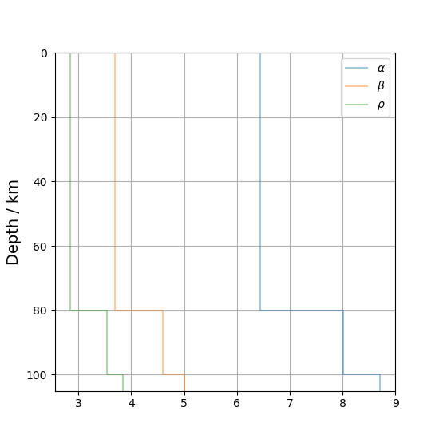
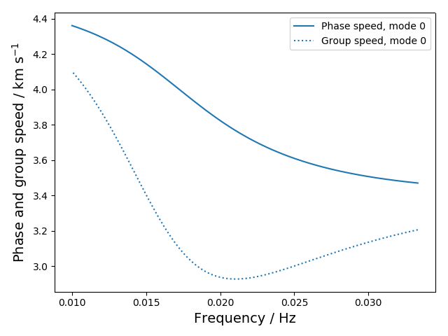
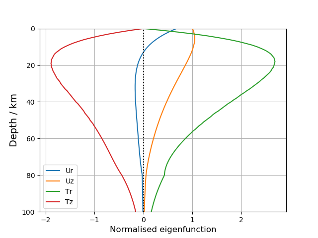
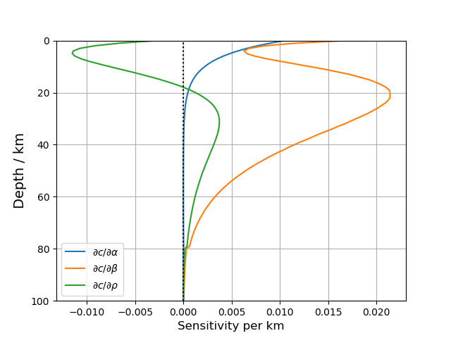
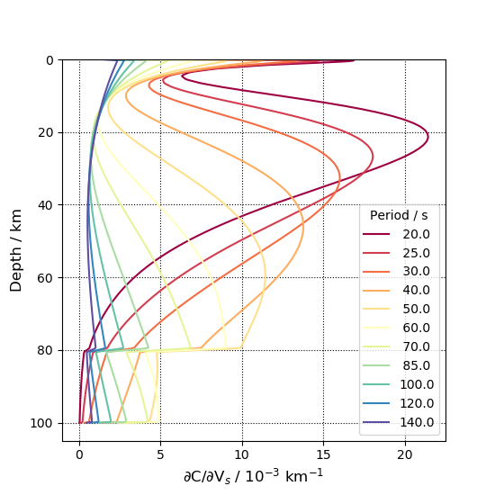
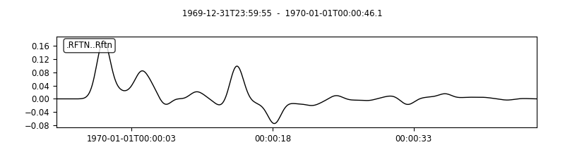
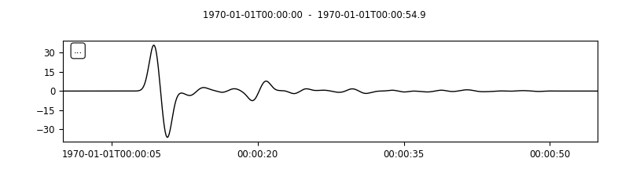

# PyLayeredModel
## What it is
**PyLayeredModel** is a collection of Python wrappers for a small subset of the seismological codes found in the Fortran packages Computer Programs in Seismology ([**CPS**](http://www.eas.slu.edu/eqc/eqccps.html); [Herrmann 2013](https://doi.org/10.1785/0220110096)) and [**Rftn**](http://eqseis.geosc.psu.edu/cammon/HTML/RftnDocs/rftn01.html). This subset of programs performs calculations relating to transversely-isotropic Earth models (consisting of stacks of internally homogeneous layers). The wrappers may allow you to work more quickly with these Fortran-based codes, which are usually manipulated using bash shell scripts. The compiled Fortran routines are called via the Python core module `subprocess`.

## What's included
Currently, wrappers are written to calculate the following properties using **CPS**:

* For Rayleigh and Love waves:
  * Phase and group speed dispersion, using `sdisp96`;
  * Eigenfunctions and sensitivity kernels, using `sregn96` and `slegn96`;
  * Sensitivity kernels using `srfker96`.
* Receiver functions, using `trftn96` ;

Additionally, one wrapper is provided for **Rftn**, which calculates:

* The Earth-response function, using `respknt`. 

## Software requirements
For Earth-response functions, you need to compile `respknt` from **Rftn**. For all of the other programs, you need to compile **CPS**. Follow the compilation instructions given in the links above.

To run this Python code, you need to have [**Python3**](https://www.python.org/) installed with the [**NumPy**](https://numpy.org/) library. To work with Earth-response functions and receiver functions, you will also need the [**ObsPy**](https://github.com/obspy/obspy/wiki) library, which we use to handle the [**SAC**](http://ds.iris.edu/files/sac-manual/) files. For plotting, you will need [**Matplotlib**](https://matplotlib.org/). We recommend using [**Anaconda**](https://www.anaconda.com/) to assemble these Python libraries.

## Getting started

Compile Fortran programs and Python modules you need, based on the section above. Clone this project from GitHub, navigate to the base directory, and try

`python3 examples.py 1`

where `1` means the first example. You should get something like the figures shown in the next section. Look at the scripts in `examples.py` to see how to build your own models.

## Examples

### 1. Dispersion

### 2. Eigenfunctions and sensitivity kernels

### 3. More sensitivity kernels

### 4. Receiver functions

### 5. Earth-response functions

## Future work

We only add something if we need it for our research, and no additions are planned at this time. Please feel free to request features, report bugs, or make contributions.

## Similar packages

Other wrappers for **CPS** in Python:

* [**CPSPy**](https://github.com/NoisyLeon/CPSPy) Dispersion, kernels and possibly more.
* [**CPyS**](https://github.com/kmch/CPyS) A Python and bash wrapper for inversion of receiver functions and surface waves using **CPS**.
* [**Geopy**](https://github.com/HouseJaay/Geopy) Wrapper for CPS `sacfmt96`, eigenfunction routines, `srfker96`, as well as some format manipulations, plotting, and a variety of other seismological tasks not related to CPS wrappers.
* [**pysurf96**](https://github.com/miili/pysurf96) Dispersion calculations, wrapped using `f2py` instead of `subprocess`, so it should be faster than **PyLayeredModel**.
* [**srfpython**](https://github.com/obsmax/srfpython) 'Compute, display and invert 1-D models'.

A Python library calculating dispersion from scratch, including radial anisotropy:

* [**dispersion**](https://github.com/tbmcoding/dispersion)

A different Fortran library offering similar calculations:

* [**SensKernel**](https://github.com/NoiseCIEI/SensKernel).

## Credit

If you use any of the **CPS** codes in published research, you must cite [Herrmann (2013)](https://doi.org/10.1785/0220110096). If you use `respknt` from **Rftn**, you must cite [Randall (1994)](https://doi.org/10.1111/j.1365-246X.1994.tb04687.x). If you found these Python wrappers helpful, please mention the **PyLayeredModel** [GitHub page](https://github.com/harrymd/PyLayeredModel) in your acknowledgement section.
